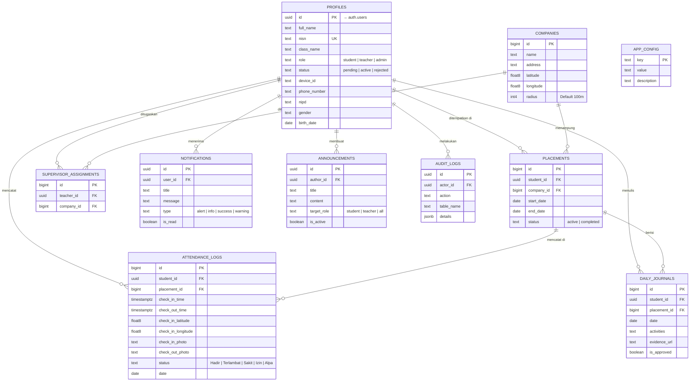

# 📱 E-PKL — Sistem Manajemen Praktik Kerja Lapangan

<p align="center">
  <strong>Aplikasi digital lengkap untuk memantau kehadiran, jurnal, dan aktivitas siswa SMK selama Praktik Kerja Lapangan (PKL)</strong>
</p>

<p align="center">
  
  
  
  
  
  
  <br/>
  
  
  
</p>

---

## 📋 Daftar Isi

- [Tentang Proyek](#-tentang-proyek)
- [Fitur Utama](#-fitur-utama)
- [Tech Stack](#-tech-stack)
- [Arsitektur Sistem](#-arsitektur-sistem)
- [Skema Database](#-skema-database)
- [Instalasi & Deployment](#-instalasi--deployment)
- [Menjalankan Aplikasi](#-menjalankan-aplikasi)
- [Struktur Folder](#-struktur-folder)
- [Keamanan](#-keamanan)
- [Screenshots](#-screenshots)
- [Contributing](#-contributing)
- [Kontributor](#-kontributor)
- [Lisensi](#-lisensi)

---

## 🎯 Tentang Proyek

**E-PKL** adalah sistem manajemen Praktik Kerja Lapangan (PKL) berbasis digital yang terdiri dari **aplikasi mobile** (siswa & guru pembimbing) dan **admin dashboard web** (sekolah). Dikembangkan khusus untuk kebutuhan SMK dengan fitur geo-tagging, anti fake GPS, dan monitoring real-time.

### Latar Belakang

Siswa SMK wajib menjalani PKL di Dunia Usaha & Industri (DUDI). Proses manual yang selama ini digunakan memiliki banyak kelemahan:

| Masalah Manual | Solusi Digital E-PKL |
|----------------|---------------------|
| Absensi kertas mudah hilang/dipalsukan | ✅ Absensi GPS + selfie + anti fake GPS |
| Sulit memantau siswa dari sekolah | ✅ Live monitoring via peta real-time |
| Jurnal kegiatan sering kosong | ✅ Notifikasi otomatis jika jurnal belum diisi |
| Rekap manual memakan waktu | ✅ Export otomatis ke PDF & Excel |
| Guru pembimbing sulit koordinasi | ✅ Dashboard per guru + notifikasi WhatsApp |

---

## ✨ Fitur Utama

### 📱 Aplikasi Mobile — Siswa (Flutter)

| Fitur | Deskripsi |
|-------|-----------|
| **🔐 Login NISN** | Autentikasi dengan NISN sebagai email + password |
| **📍 Check-in/Check-out GPS** | Absensi berbasis lokasi dengan validasi radius (50–100m) |
| **🛡️ Anti Fake GPS** | Deteksi mock location, low accuracy, dan speed anomaly |
| **📸 Selfie Verification** | Foto selfie wajib saat check-in dan check-out |
| **📝 Jurnal Harian** | Pencatatan aktivitas harian dengan foto bukti kegiatan |
| **📊 Riwayat Kehadiran** | Statistik kehadiran bulanan (Hadir/Terlambat/Sakit/Izin/Alpa) |
| **📢 Pengumuman** | Banner informasi dari sekolah |
| **🔔 Notifikasi** | Push notification untuk pengumuman & peringatan |
| **🔒 Biometric Auth** | Login dengan fingerprint/Face ID |
| **📴 Offline Mode** | Penyimpanan lokal saat tidak ada internet |

### 📱 Aplikasi Mobile — Guru Pembimbing (Flutter)

| Fitur | Deskripsi |
|-------|-----------|
| **👨‍🏫 Dashboard Bimbingan** | Daftar siswa yang dibimbing per perusahaan |
| **📋 Monitoring Kehadiran** | Lihat status kehadiran siswa bimbingan |
| **✅ Approval Jurnal** | Setujui/tolak jurnal kegiatan siswa |
| **🔔 Notifikasi Peringatan** | Alert otomatis jika siswa bolos > 3 hari |

### 💻 Admin Dashboard Web (React)

| Fitur | Deskripsi |
|-------|-----------|
| **📈 Dashboard Analytics** | Statistik kehadiran real-time dengan chart & grafik tren |
| **📊 Ringkasan Per Kelas** | Tabel breakdown kehadiran per kelas |
| **🗺️ Live Monitoring Map** | Peta real-time lokasi check-in siswa |
| **👥 Manajemen Siswa** | CRUD data siswa + import batch via Excel/CSV |
| **🏢 Manajemen DUDI** | Data perusahaan dengan map picker (Google Maps) |
| **👨‍🏫 Manajemen Guru** | Buat akun guru + assign ke perusahaan |
| **📋 Input & Laporan Kehadiran** | Rekap harian, filter per kelas, edit status manual |
| **📝 Approval Jurnal** | Review dan approval jurnal kegiatan siswa |
| **📊 Rekap Bulanan** | Export laporan kehadiran per siswa ke PDF |
| **📢 Pengumuman** | Broadcast pesan ke siswa/guru/semua |
| **🔔 Notifikasi** | Pusat notifikasi admin |
| **⚙️ Pengaturan** | Konfigurasi aplikasi & WhatsApp gateway |
| **📜 Audit Logs** | Jejak aktivitas seluruh admin |
| **📲 WhatsApp Alert** | Notifikasi otomatis ke ortu/guru via WhatsApp |

---

## 🛠️ Tech Stack

### Mobile Application (Flutter)

| Kategori | Teknologi | Versi |
|----------|-----------|-------|
| **Framework** | Flutter (Dart) | 3.22+ (Dart ^3.10.4) |
| **State Management** | Riverpod | 3.1 |
| **Routing** | Go Router | 17.0 |
| **Backend** | Supabase Flutter | 2.12 |
| **Maps** | Google Maps Flutter | 2.14 |
| **GPS** | Geolocator | 14.0 |
| **Camera** | Image Picker + Image Compress | 1.2 / 2.4 |
| **Auth** | Local Auth (Biometrik) + Secure Storage | 3.0 / 10.0 |
| **Code Gen** | Freezed + JSON Serializable | 3.2 / 6.11 |
| **UI** | Google Fonts, Lucide Icons, Shimmer | — |
| **Offline** | Shared Preferences, Connectivity Plus | — |
| **Export** | Excel 4.0 | 4.0 |
| **Device Info** | Device Info Plus | 12.3 |
| **Network Image** | Cached Network Image | 3.4 |

### Admin Dashboard (React)

| Kategori | Teknologi | Versi |
|----------|-----------|-------|
| **Framework** | React + TypeScript | 19.2 / 5.9 |
| **Build Tool** | Vite | 7.2 |
| **Styling** | TailwindCSS | 4.1 |
| **State** | TanStack Query | 5.9 |
| **Routing** | React Router DOM | 7.12 |
| **UI** | Radix UI + ShadCN/UI | — |
| **Tables** | TanStack Table | 8.21 |
| **Forms** | React Hook Form + Zod | 7.71 / 4.3 |
| **Charts** | Recharts | 2.15 |
| **PDF** | jsPDF + AutoTable | 4.0 / 5.0 |
| **Excel** | PapaParse + XLSX | 5.5 / 0.18 |
| **Maps** | React Google Maps API | 2.20 |
| **Drag & Drop** | dnd-kit | 6.3 |
| **Toast** | Sonner | 2.0 |
| **Theme** | next-themes | 0.4 |

### Backend & Infrastructure

| Kategori | Teknologi |
|----------|-----------|
| **BaaS** | Supabase (PostgreSQL 15+) |
| **Authentication** | Supabase Auth (Email/Password) |
| **File Storage** | Supabase Storage (2 buckets) |
| **API** | Supabase REST API + Realtime Subscriptions |
| **Edge Functions** | Deno Runtime (2 functions) |
| **Security** | Row Level Security (RLS) + SECURITY DEFINER functions |
| **Hosting Web** | Vercel |
| **Source Control** | GitHub |
| **WhatsApp API** | Fonnte (opsional) |

---

## 🏗️ Arsitektur Sistem

```
┌──────────────────────┐
│    Flutter App        │
│  (Android / iOS)      │
│                       │
│  • Siswa: Check-in,   │
│    Jurnal, Riwayat    │
│  • Guru: Monitoring,  │
│    Approval Jurnal    │
└──────────┬───────────┘
           │ REST API + Realtime
           ▼
┌──────────────────────┐     ┌──────────────────────┐
│      Supabase        │     │    Admin Web          │
│    (Backend)          │◄────│    (Vercel)           │
│                       │     │                       │
│  • PostgreSQL (10     │     │  • React 19 + Vite    │
│    tabel + 9 RPC)     │     │  • Dashboard Analytics│
│  • Auth               │     │  • CRUD Siswa/Guru    │
│  • Storage            │     │  • Reports PDF        │
│  • Edge Functions     │     │  • Live Map           │
│  • Realtime           │     │  • Import Excel       │
└──────────┬───────────┘     └───────────────────────┘
           │
    ┌──────┴──────┐
    │  Fonnte     │
    │  WhatsApp   │
    │  Gateway    │
    └─────────────┘
```

---

## 🗄️ Skema Database

### Entity Relationship Diagram



### Ringkasan 10 Tabel

| Tabel | Deskripsi |
|-------|-----------|
| `profiles` | Data pengguna (siswa/guru/admin) — 20+ kolom |
| `companies` | Data DUDI dengan koordinat GPS & radius |
| `placements` | Penempatan siswa ↔ perusahaan |
| `attendance_logs` | Log kehadiran dengan geo-tagging & foto |
| `daily_journals` | Jurnal aktivitas harian + bukti foto |
| `supervisor_assignments` | Penugasan guru pembimbing ↔ perusahaan |
| `announcements` | Pengumuman broadcast per role |
| `notifications` | Notifikasi in-app |
| `app_config` | Konfigurasi key-value (WhatsApp gateway dll) |
| `audit_logs` | Jejak audit aktivitas admin |

### RPC Functions (9 endpoints)

| Function | Kegunaan |
|----------|----------|
| `get_my_role()` | Helper RLS: ambil role user saat ini |
| `create_teacher_user()` | Admin: buat akun guru via RPC |
| `check_attendance_violations()` | Cek siswa bolos > 3 hari + kirim WhatsApp |
| `count_attendance_by_grade()` | Dashboard: statistik kehadiran per grade |
| `get_attendance_trend_by_grade()` | Dashboard: tren kehadiran 90 hari |
| `get_class_attendance_summary()` | Dashboard: ringkasan per kelas |
| `get_students_by_attendance_status()` | Attendance: list siswa + status per tanggal |
| `get_distinct_classes()` | Dropdown: daftar kelas unik |
| `handle_new_user()` | Trigger: auto-create profile on signup |

### Edge Functions (Supabase)

| Function | Kegunaan |
|----------|----------|
| `import-students` | Import batch siswa dari Excel/CSV dengan validasi |
| `send-whatsapp` | Kirim notifikasi WhatsApp via Fonnte gateway |

---

## 🚀 Instalasi & Deployment

> **📘 Panduan lengkap tersedia di [`docs/SETUP.md`](docs/SETUP.md)**

### Quick Start

#### 1. Setup Supabase Database

```bash
# Jalankan 7 file SQL di Supabase SQL Editor secara berurutan:
docs/database/01_extensions.sql    # Extensions
docs/database/02_tables.sql        # 10 tabel
docs/database/03_rls_policies.sql  # RLS policies
docs/database/04_functions_triggers.sql  # 9 functions + triggers
docs/database/05_views_indexes.sql # Views, indexes, realtime
docs/database/06_storage.sql       # Storage buckets
docs/database/07_seed_data.sql     # Default config
```

#### 2. Setup Admin Web

```bash
cd admin-web
cp .env.example .env     # Edit dengan kredensial Supabase & Google Maps
npm install
npm run dev              # → http://localhost:5173
```

#### 3. Setup Flutter App

```bash
# Edit kredensial Supabase
# → lib/src/services/supabase_config.dart

# Edit Google Maps API Key
# → android/app/src/main/AndroidManifest.xml

flutter pub get
flutter run
```

#### 4. Deploy Edge Functions

```bash
supabase login
supabase link --project-ref <project-id>
supabase functions deploy send-whatsapp --no-verify-jwt
supabase functions deploy import-students --no-verify-jwt
```

### Environment Variables

#### Admin Web (`admin-web/.env`)

```env
VITE_SUPABASE_URL=https://<project-id>.supabase.co
VITE_SUPABASE_ANON_KEY=<anon-public-key>
VITE_GOOGLE_MAPS_API_KEY=<google-maps-api-key>
SERVICE_ROLE_KEY=<service-role-key>   # Hanya untuk admin scripts
```

#### Flutter App (`lib/src/services/supabase_config.dart`)

```dart
static const String supabaseUrl = 'https://<project-id>.supabase.co';
static const String supabaseAnonKey = '<anon-public-key>';
```

#### Google Maps API Key

| Platform | Lokasi |
|----------|--------|
| Android | `android/app/src/main/AndroidManifest.xml` |
| iOS | `ios/Runner/AppDelegate.swift` |
| Web | `admin-web/.env` → `VITE_GOOGLE_MAPS_API_KEY` |

---

## ▶️ Menjalankan Aplikasi

### Flutter Mobile App

```bash
flutter run                          # Debug mode
flutter build apk --release          # Build APK
flutter build appbundle --release    # Build AAB (Play Store)
flutter build ipa --release          # Build iOS (macOS only)
```

### Admin Dashboard

```bash
cd admin-web
npm run dev       # Development → http://localhost:5173
npm run build     # Production build
npm run preview   # Preview production build
```

---

## 📁 Struktur Folder

```
E-PKL/
│
├── lib/                             # 📱 Flutter Mobile App
│   ├── main.dart                    # Entry point
│   └── src/
│       ├── features/
│       │   ├── attendance/          # Check-in/out GPS + selfie
│       │   ├── authentication/      # Login, splash, verification
│       │   ├── home/                # Home screen + announcements
│       │   ├── journal/             # Jurnal kegiatan harian
│       │   ├── profile/             # Profil pengguna
│       │   ├── teacher/             # Dashboard guru pembimbing
│       │   ├── admin/               # Dashboard admin (mobile)
│       │   └── offline/             # Offline mode support
│       ├── routing/                 # Go Router configuration
│       ├── services/                # Supabase config & services
│       └── common_widgets/          # Reusable UI components
│
├── admin-web/                       # 💻 React Admin Dashboard
│   ├── .env.example                 # Template environment variables
│   └── src/
│       ├── features/
│       │   ├── dashboard/           # Analytics, charts, monitoring map
│       │   ├── students/            # CRUD + import batch siswa
│       │   ├── teachers/            # CRUD guru + assign perusahaan
│       │   ├── companies/           # CRUD DUDI + map picker
│       │   ├── attendance/          # Input & laporan kehadiran
│       │   ├── journals/            # Approval jurnal kegiatan
│       │   ├── reports/             # Rekap bulanan + live map
│       │   ├── announcements/       # Broadcast pengumuman
│       │   ├── notifications/       # Pusat notifikasi
│       │   ├── settings/            # Pengaturan & WhatsApp config
│       │   ├── audit-logs/          # Jejak audit admin
│       │   ├── import/              # Import Excel/CSV
│       │   ├── auth/                # Login admin
│       │   ├── pkl-dashboard/       # Overview PKL
│       │   └── teacher-attendance/  # View kehadiran per guru
│       ├── components/              # Layout + ShadCN UI components
│       ├── contexts/                # AuthContext
│       ├── hooks/                   # Custom React hooks
│       └── lib/                     # Supabase client & utilities
│
├── android/                         # Android native config
├── ios/                             # iOS native config
│
├── supabase/
│   ├── functions/                   # Edge Functions
│   │   ├── send-whatsapp/           # WhatsApp notification
│   │   ├── import-students/         # Batch student import
│   │   └── _shared/                 # Shared utils (rate-limit, schema)
│   └── migrations/                  # SQL migration history
│
├── docs/                            # 📚 Dokumentasi
│   ├── SETUP.md                     # ⭐ Panduan setup & deploy lengkap
│   ├── database/                    # 7 file SQL setup (urut 01-07)
│   ├── prd.md                       # Product Requirement Document
│   └── changelog.md                 # Riwayat perubahan
│
└── pubspec.yaml                     # Flutter dependencies
```

---

## 🔐 Keamanan

### Authentication & Authorization

| Mekanisme | Detail |
|-----------|--------|
| **Auth Provider** | Supabase Auth (Email/Password) |
| **Biometric** | Fingerprint/Face ID via `local_auth` |
| **Token Storage** | `flutter_secure_storage` (encrypted) |
| **Role-Based Access** | 3 role: `student`, `teacher`, `admin` |
| **RLS** | Row Level Security on all 10 tables |
| **SECURITY DEFINER** | Functions with elevated privileges |
| **Rate Limiting** | Edge Function rate-limit (20 req/min) |

### Anti-Fraud Measures

| Mekanisme | Deskripsi |
|-----------|-----------|
| **Mock Location Detection** | Deteksi fake GPS provider |
| **Low Accuracy Rejection** | Tolak jika akurasi GPS > threshold |
| **Speed Anomaly Check** | Deteksi pergerakan tidak wajar |
| **Selfie Verification** | Foto wajib (front camera only) |
| **Geofencing** | Validasi radius 50–100m dari lokasi DUDI |
| **Device Binding** | Tracking `device_id` per user |

### Data Protection

- Semua environment variables di-exclude dari Git (`.gitignore`)
- `service_role_key` hanya digunakan di server-side (Edge Functions)
- File `.jks` / keystore di-exclude dari repository
- Storage buckets menggunakan RLS policies

---

## 📸 Screenshots

> *Tambahkan screenshots aplikasi di sini*

### Mobile App

| Login | Check-in | Jurnal | Riwayat |
|-------|----------|--------|---------|
|  |  |  |  |

### Admin Dashboard

| Dashboard | Manajemen Siswa | Live Map | Laporan |
|-----------|----------------|----------|---------|
|  |  |  |  |

---

## 🤝 Kontributor

<table>
  <tr>
    <td align="center">
      <a href="https://github.com/suhendararyadi">
        
        <br /><sub><b>Suhendra Ryadi</b></sub>
      </a>
      <br/>Lead Developer
    </td>
  </tr>
</table>

---

## 🤝 Contributing

Kontribusi sangat diterima! Silakan:

1. Fork repository ini
2. Buat branch fitur (`git checkout -b feature/fitur-baru`)
3. Commit perubahan (`git commit -m 'Add: fitur baru'`)
4. Push ke branch (`git push origin feature/fitur-baru`)
5. Buat Pull Request

### Panduan Kontribusi

- Pastikan kode mengikuti style guide yang sudah ada
- Tambahkan dokumentasi untuk fitur baru
- Tulis test jika memungkinkan
- Gunakan Bahasa Indonesia untuk commit message dan dokumentasi

---

## 📝 Lisensi

Proyek ini dilisensikan di bawah **MIT License** — lihat file [LICENSE.md](./LICENSE.md) untuk detail.

Anda bebas menggunakan, memodifikasi, dan mendistribusikan proyek ini untuk keperluan apapun, termasuk komersial.

---

<p align="center">
  Made with ❤️ by <a href="https://github.com/suhendararyadi">Suhendra Ryadi</a>
  <br/>
  <sub>© 2026 E-PKL — Open Source under MIT License</sub>
</p>
